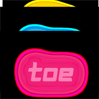

# 🎮 Tic-Tac-Toe — AI Enhanced Game

> *Classic Tic-Tac-Toe reimagined with an AI opponent. Can you outsmart the machine?*

<div>
  
</div>

---

## 📌 Table of Contents

- [About the Project](#about-the-project)
- [Live Demo](#live-demo)
- [Features](#features)
- [Game Modes](#game-modes)
- [AI Difficulty Levels](#ai-difficulty-levels)
- [Themes](#themes)
- [Tech Stack](#tech-stack)
- [Pages & Sections](#pages--sections)
- [Project Structure](#project-structure)
- [Getting Started](#getting-started)
- [Learning Outcomes](#learning-outcomes)
- [Developer](#developer)

---

## 📖 About the Project

**Tic-Tac-Toe — AI Enhanced Game** is a feature-rich, browser-based version of the classic Tic-Tac-Toe game built using **HTML, CSS, and JavaScript**. It goes beyond the basics by introducing an AI opponent with three difficulty levels, multiple visual themes, sound effects, background music, and a live score tracker — all packed into a smooth, responsive UI.

Whether you want to challenge a friend or test your skills against an unbeatable AI, this game has you covered.

---

## 🌐 Live Demo

🔗 **[https://tic-tac-toe-game-nine-fawn.vercel.app/](https://ai-enhanced-tic-tac-toe-game.vercel.app/)**

---

## ✨ Features

- 🤖 **AI Opponent** — Play against a smart AI with Easy, Medium, and Hard difficulty levels
- 👥 **Two Game Modes** — Player vs Player and Player vs AI
- 🎨 **4 Visual Themes** — Classic, Dark, Neon, and Nature
- 🔊 **Sound Effects** — Toggle ON/OFF with adjustable volume (0–100%)
- 🎵 **Background Music** — Toggle ON/OFF for an immersive experience
- 📊 **Live Score Tracker** — Tracks wins for Player X, Player O, and Draws in real time
- 🔄 **New Game Button** — Restart the current round instantly
- 🔁 **Reset Score Button** — Clear all scores and start fresh
- ⚙️ **Game Settings Panel** — Modal settings popup for full game customisation
- 🎉 **Win / Draw Announcements** — Animated result popups for wins and ties
- 💭 **AI Thinking Indicator** — "AI is thinking..." message for a realistic feel
- 📱 **Fully Responsive** — Works seamlessly on desktop, tablet, and mobile

---

## 🕹️ Game Modes

| Mode | Description |
|---|---|
| **Player vs Player** | Two players take turns on the same device |
| **Player vs AI** | One player competes against the AI opponent |

---

## 🤖 AI Difficulty Levels

| Level | Behaviour |
|---|---|
| 🟢 **Easy** | AI makes random moves — great for beginners |
| 🟡 **Medium** | AI uses basic strategy — blocks obvious wins |
| 🔴 **Hard** | AI uses the Minimax algorithm — nearly unbeatable |

---

## 🎨 Themes

| Theme | Description |
|---|---|
| ☀️ **Classic** | Clean white and minimal — the original look |
| 🌑 **Dark** | Sleek dark mode for low-light play |
| 💜 **Neon** | Vibrant neon colours with a glowing aesthetic |
| 🌿 **Nature** | Earthy green tones for a calm, natural feel |

---

## 🛠️ Tech Stack

| Technology | Purpose |
|---|---|
| **HTML5** | Game structure and semantic markup |
| **CSS3** | Themes, animations, transitions, and responsive layout |
| **JavaScript (ES6+)** | Game logic, AI engine, sound, score tracking, and DOM manipulation |
| **Vercel** | Deployment and hosting |

> No frameworks, no libraries, no build tools — built with **pure vanilla HTML, CSS & JavaScript**.

---

## 📄 Pages & Sections

```
/ (index.html)
│
├── Header              → Game title
├── Settings Modal      → Game Mode | AI Difficulty | Theme | Sound | Music
├── Score Board         → Player X score | Draws | Player O score
├── Game Board          → 3×3 interactive grid
├── Controls            → New Game + Reset Score buttons
├── Player Labels       → Player X and Player O name display
├── Win Popup           → 🎉 Congratulations message on win
├── Draw Popup          → 🤝 Tie game message
└── AI Indicator        → "AI is thinking..." overlay
```

---

## 📁 Project Structure

```
tic-tac-toe/
│
├── index.html                  # Main game page
├── style.css                   # All styles — themes, layout, animations
├── script.js                   # Game logic, AI (Minimax), sound & score management
├── assets/                     # Images, audio, and other static assets
     ├── favicon.ico            # Site favicon
     ├── Tic-Tac-Toe poster     # Game Poster
```

---

## 🚀 Getting Started

No installation or dependencies needed. Clone and play instantly.

### 1. Clone the Repository

```bash
git clone https://github.com/anshuman-sahu-dev/tic-tac-toe.git
```

### 2. Navigate to the Project Folder

```bash
cd tic-tac-toe
```

### 3. Open in Browser

```bash
# On macOS
open index.html

# On Windows
start index.html

# Or simply drag and drop index.html into any browser
```

> ⚡ Zero setup — open and play right away!

---

## 🧠 Learning Outcomes

Building this project helped practice and reinforce:

- ✅ Vanilla JavaScript game logic and state management
- ✅ Implementing the **Minimax algorithm** for an unbeatable AI
- ✅ CSS theming with custom properties (CSS variables) for multiple themes
- ✅ DOM manipulation for dynamic UI updates
- ✅ Working with the **Web Audio API** for sound effects and music
- ✅ Building modal/popup UI components from scratch
- ✅ Responsive design without any CSS framework
- ✅ Deploying a static site to Vercel

---

## 📬 Contact

For any queries, feedback, or collaboration:

[](mailto:toanshumansahu@gmail.com) <br>
[](tel:+917854939308) <br>
[](https://github.com/anshuman-sahu-dev) <br>
[](https://www.linkedin.com/in/anshuman-sahu-371a6535b/) <br>
[](#) <br>

---
## 👨‍💻 Developer

<div align="center">

### ✨ Made with ❤️ by

# 🧑‍💻 Anshuman Sahu


---

📧 **Email:** toanshumansahu@gmail.com
📞 **Phone:** +91 78549 39308

---

[](https://github.com/anshuman-sahu-dev)
[](https://tic-tac-toe-game-nine-fawn.vercel.app/)
[](#)
[](#)
[](#)

---


</div>
